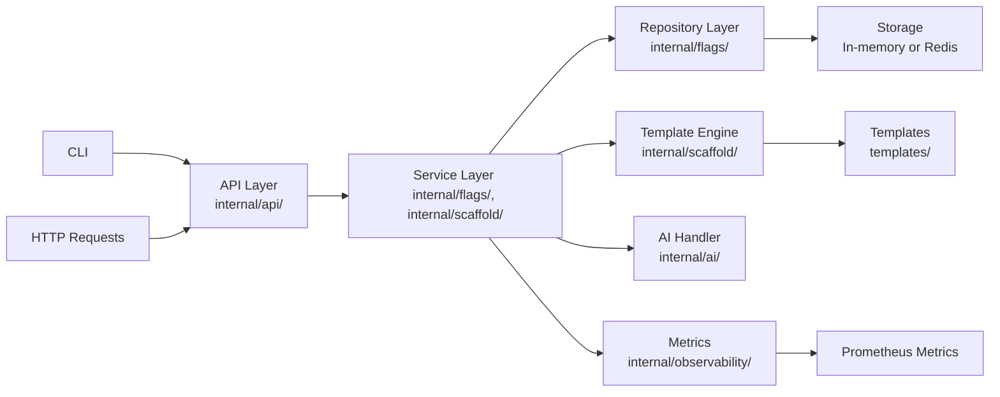

# goldpath – Internal Developer Platform in a Box

goldpath is a small but production-style internal developer platform that lets any engineer create a fully wired service (code, CI/CD, Kubernetes, observability, and feature flags) in minutes instead of days.

## Visual Overview

```mermaid
graph TD
    A[Developer runs goldpath new <service-name>] --> B[Generate: Go service + Dockerfile]
    A --> C[Generate: CI/CD pipeline (GitHub Actions)]
    A --> D[Generate: Kubernetes deployment]
    A --> E[Generate: Health checks & metrics]
    B --> F[Service runs in Kubernetes cluster]
    C --> F
    D --> F
    E --> F
    F --> G[Metrics + Logs available]
    F --> H[Feature flags ready to use]
```

| Capability               | What it gives a team                          | What it shows about me                          |
|--------------------------|-----------------------------------------------|-------------------------------------------------|
| Golden-path scaffolding  | New services created in a consistent, secure way in minutes | I think in terms of platform products, not just code |
| Feature flags            | Controlled rollouts and quick rollbacks        | I prioritize safe feature delivery               |
| Observability & SLOs     | Metrics, logs, and error budget tracking       | I build reliability into platforms from the start |
| AI-assisted workflows    | Smart config suggestions for pipelines         | I integrate AI to reduce developer friction      |
| Security defaults        | Safe, tested templates that prevent mistakes   | I treat infrastructure as product with security first |

## Why I Built This

I built goldpath to demonstrate how I think like a platform engineer: reducing friction for other developers, standardizing best practices, and making the "right thing" the easy thing.

In real teams, I've seen the pain of:
- New engineers spending days setting up services instead of building features
- Teams reinventing CI/CD and Kubernetes config from scratch
- Monitoring and reliability practices being inconsistent across the org
- Feature flags being copy-pasted or missing entirely

goldpath is how I would start building an internal developer platform for a real company – focusing on the most impactful pain points first.

## Problem: Life Before goldpath

| Situation                | Before goldpath                                | After goldpath                                  |
|--------------------------|-----------------------------------------------|-------------------------------------------------|
| Spinning up a new service | 2–5 days of copying old repos, fixing CI, wiring configs | 10–15 minutes using one guided command |
| Consistency              | Each team has its own way of doing things      | Shared golden path with proven templates        |
| Reliability              | Monitoring and alerts are bolted on later      | Health checks, metrics, and SLOs are built-in from day one |
| Risk                     | Easy to skip security checks under time pressure | Secure defaults baked into the templates        |

## Solution: Life After goldpath

goldpath is a product that gives you:
"One command that gives you a ready-to-deploy service with everything wired together."

You get:
- Production-ready Go code
- Dockerfile with multi-stage build
- CI/CD pipeline (GitHub Actions)
- Kubernetes deployment manifest
- Health checks and Prometheus metrics
- Feature flag system out of the box

### Elevator Pitch for Managers

- **Speed**: New services ready to deploy in minutes, not days
- **Safety**: Controlled feature rollouts with quick rollbacks
- **Consistency**: Every service follows the same proven patterns
- **Visibility**: Built-in metrics and SLO tracking from day one

## Key Features

### High-Level Features (for managers)

- Golden-path project generator
- Built-in feature flags with percentage rollouts
- Built-in metrics and SLO tracking
- Simple AI-assisted config suggestions
- 100% automation-friendly (CLI, API)

### Technical Details

#### Golden Path Scaffolding CLI

```bash
goldpath new <service-name> --lang go --cloud aws
```

Generates:
- Go service with structured logging and graceful shutdown
- Dockerfile with multi-stage build for security and size
- CI/CD pipeline (GitHub Actions) with tests and deployments
- Kubernetes deployment with health checks and resource limits

#### Feature Flag Service

- REST API for creating and toggling feature flags
- Supports percentage rollout (e.g., 10% of users get new feature)
- Pluggable backend (in-memory for local dev, Redis for production)
- Metrics for flag evaluations and rollout status

#### Observability & SLOs

- Exposes Prometheus metrics (latency, errors, flag evaluations)
- Tracks error budget against target SLO (e.g., 99.5% success rate)
- Helps teams see when they are "burning" their reliability budget
- Health check endpoint for Kubernetes liveness and readiness probes

#### AI-Driven Workflow Endpoint

- Suggests CI/CD or pipeline configs based on input
- Uses OpenAI API if available; falls back to safe defaults if not
- Integrates directly with the scaffolding process
- Reduces time spent on boilerplate configuration

#### Operational Excellence

- Graceful shutdown for zero-downtime deployments
- Structured logging for easy debugging
- Clear configuration via environment variables
- Prometheus metrics exposed at `/metrics`

## Architecture & Tech Specs



| Area                     | Technology                                     | Why I chose it                                  |
|--------------------------|-----------------------------------------------|-------------------------------------------------|
| Language                 | Go                                             | Fast, simple, great for backend services        |
| HTTP routing             | chi                                             | Lightweight router for clean REST APIs          |
| CLI                      | cobra                                           | Standard choice for professional Go CLIs        |
| Metrics                  | Prometheus client                               | Industry standard for monitoring                |
| Storage                  | In-memory + Redis option                        | Easy local dev, scalable in prod                |
| Config                   | Environment variables                           | Works well in containers and cloud               |
| Container                | Docker + multi-stage build                      | Small, secure runtime image                     |

### Architecture Principles

- **Clean Architecture**: Separation between handler → service → repository layers
- **Dependency Injection**: No global state, dependencies injected via interfaces
- **Testable Code**: Unit tests for core business logic
- **Pluggable Storage**: Easy to swap between in-memory and Redis

## Security First

I treat infrastructure and tooling with the same security care as user-facing apps. Secure defaults help prevent mistakes by busy developers.

### Security-Minded Choices

| Design choice            | Why it matters                                  | What it shows about me                          |
|--------------------------|-----------------------------------------------|-------------------------------------------------|
| Read-only defaults       | Reduces risk of accidental damage              | I think about least privilege and safety        |
| No secrets in code or Git | Prevents common security leaks                 | I build with real-world security in mind        |
| Multi-stage Docker build | Smaller attack surface                          | I care about secure, production-ready images    |
| Environment-based config | Secrets stay out of code                        | I follow 12-factor app principles               |
| Safe metrics endpoints   | No sensitive data exposed                       | I design with observability without risk        |

### Separation of Concerns

- **Template creators**: Can define golden path templates
- **Service generators**: Can use templates but not modify them
- **Flag admins**: Can create and manage flags
- **Flag evaluators**: Can only evaluate flags

## How It Works (Step-by-Step Walkthrough)

1. **Developer creates a new service**  
   Runs `goldpath new payments-service --lang go --cloud aws` to generate a complete service.

2. **Code and config are generated**  
   goldpath creates Go code, Dockerfile, CI/CD pipeline, and Kubernetes manifest.

3. **Code is pushed and pipeline runs**  
   Developer pushes code to GitHub; GitHub Actions runs tests and builds the service.

4. **Service is deployed**  
   Kubernetes manifest is applied; service runs with health checks and metrics.

5. **Feature flag is created**  
   Engineer creates a flag for a new payment feature with 10% rollout.

6. **Feature is tested and monitored**  
   Product team tests the feature; SLO metrics show no impact on reliability.

7. **Full rollout or rollback**  
   If successful, roll out to 100%; if issues, roll back in seconds.

## Local Setup & Quickstart

### Prerequisites

- Go 1.22 or later
- Docker (optional, for containerization)
- Redis (optional, for persistent flag storage)

### Step-by-Step Setup

```bash
# Clone the repository
git clone <repo-url>
cd goldpath

# Run tests
make test

# Start the API server
go run ./cmd/goldpath

# Generate a new service
goldpath new payments-service --lang go --cloud aws
```

### Configuration

| Variable                | Default          | Description                                     |
|-------------------------|------------------|-------------------------------------------------|
| `GOLDPATH_PORT`         | 8080             | Server port                                     |
| `GOLDPATH_HOST`         | 0.0.0.0          | Server host                                     |
| `GOLDPATH_LOG_LEVEL`    | info             | Log level (debug, info, warn, error)            |
| `GOLDPATH_FLAG_STORAGE` | memory           | Flag storage (memory, redis)                    |
| `GOLDPATH_REDIS_ADDR`   | localhost:6379   | Redis address                                   |
| `GOLDPATH_AI_ENABLED`   | false            | Enable AI features                              |
| `GOLDPATH_OPENAI_API_KEY` | -              | OpenAI API key                                  |

## Examples & Demo Scenarios

### Example 1: Generate a New Service

```bash
# Generate a new Go service called "auth"
goldpath new auth --lang go --cloud aws

# Output:
# Generated service: auth/
# - main.go (Go code)
# - Dockerfile (multi-stage build)
# - .github/workflows/ci.yaml (CI/CD pipeline)
# - k8s/deployment.yaml (Kubernetes config)
```

### Example 2: Create a Feature Flag

```bash
# Create a flag for a new login feature
curl -X POST http://localhost:8080/api/v1/flags \
  -H "Content-Type: application/json" \
  -d '{
    "key": "new-login-flow",
    "name": "New Login Flow",
    "description": "Redesigned login experience",
    "enabled": true,
    "rollout": 10.0
  }'
```

### Example 3: View Metrics

```bash
# Check service health and metrics
curl http://localhost:8080/health
curl http://localhost:8080/metrics
```

## Roadmap (What I’d Build Next)

### Short-Term (1–3 Months)

1. **UI Dashboard**: Visual interface for managing feature flags and service health
2. **Multi-Language Support**: Add Node.js and Python template options
3. **Pluggable Auth**: OAuth2 integration for the admin APIs

### Long-Term Vision

1. **Internal Developer Portal**: Service catalog, scorecards, and documentation
2. **Policy as Code**: Security and compliance checks before deployment
3. **AI Architecture Suggestions**: Recommend architectures based on service type
4. **Advanced SLO Management**: More granular SLO definitions and reporting

### Product Thinking

This roadmap shows how goldpath would evolve into a full internal platform:
- Start with the most painful problems (scaffolding, flags, observability)
- Add user-friendly interfaces as adoption grows
- Build policy and compliance features as scale increases
- Integrate AI to make platform decisions even easier

## How This Maps to the Job Description

| Job Requirement                                  | Where goldpath demonstrates this                |
|--------------------------------------------------|-------------------------------------------------|
| Contribute to technical roadmap for internal developer platform | Roadmap section shows evolution from MVP to full platform |
| Develop and maintain core platform features (CI/CD, observability, feature flags) | Golden-path scaffolding, metrics, and feature flag service |
| Drive operational excellence with SLAs and SLOs | Built-in metrics, SLO error budget tracking |
| Design AI-driven workflows and systems | AI suggestion endpoint and integration with platform |
| Partner with internal engineering customers | Before/After sections focused on developer pain points |
| Build secure, production-ready infrastructure | Security First section with multi-stage Docker, env config |
| Create self-service tools for developers | CLI and API-driven service generation |

## FAQ (for a Hiring Manager)

### Is this meant to be production-ready?

**No, but it's designed like a real product.** goldpath is intentionally small to demonstrate platform engineering thinking. In a real company, I would expand it with:
- More robust storage (PostgreSQL instead of in-memory/Redis)
- Hardened security (mTLS, audit logs)
- High availability (clustering)
- Scalability (horizontal scaling)

### How would this scale to a larger organization?

By:
- Adding a service catalog to track all generated services
- Implementing policy as code to enforce security rules
- Supporting multiple cloud providers and regions
- Adding SSO and role-based access control
- Building integrations with existing tools (Slack, Jira, PagerDuty)

### How hard would it be to support multiple programming languages?

**Easy.** The template engine is designed to be language-agnostic. Adding a new language (like Python or Node.js) would involve:
1. Creating templates for that language
2. Adding language-specific logic to the scaffolding engine
3. Testing the generated code and pipelines

### How does this reduce risk for engineering leadership?

- **Consistent patterns**: Every service follows the same proven architecture
- **Built-in reliability**: SLOs and monitoring are standard
- **Controlled rollouts**: Feature flags reduce release risk
- **Secure defaults**: Templates prevent common security mistakes
- **Faster recovery**: Quick rollbacks with feature flags

### What would you build next if you joined our team?

I would start by:
1. Understanding the current pain points of your engineering teams
2. Extending goldpath with templates for your most used languages
3. Integrating with your existing CI/CD and deployment tools
4. Adding a UI dashboard for easier management
5. Building policy as code to enforce your standards

## Development

### Run Tests

```bash
make test
```

### Run with Coverage

```bash
make coverage
```

### Lint

```bash
make lint
```

### Docker

```bash
# Build
make docker-build

# Run
make docker-run
```

## License

MIT License - See LICENSE file for details
